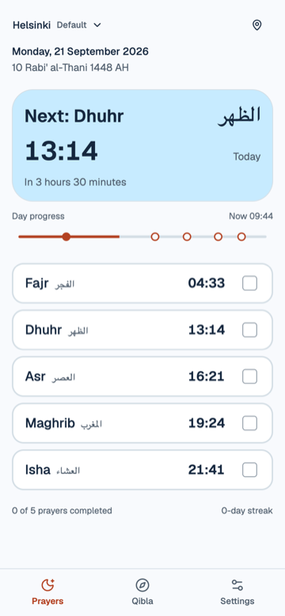

# Athan



Offline prayer times, Qibla direction, and a daily prayer tracker. No account needed.

## Run locally

Requires [Bun](https://bun.sh) 1.3+ and Git.

```bash
git clone https://github.com/ragmha/athan-pwa.git
cd athan-pwa
bun install
bun dev
```

Open [localhost:5173/athan-pwa/](http://localhost:5173/athan-pwa/), or the URL
printed in your terminal if the port differs.

## Install on your phone

Open [Athan](https://ragmha.github.io/athan-pwa/) on your phone, then:

- **iPhone (Safari):** Tap **Share** > **Add to Home Screen** > **Add**.
- **Android (Chrome):** Open the **menu** > **Install app** (or **Add to home screen**).

Prayer times work offline after the first online load. City search needs internet.

Development notes: [`AGENTS.md`](./AGENTS.md).
